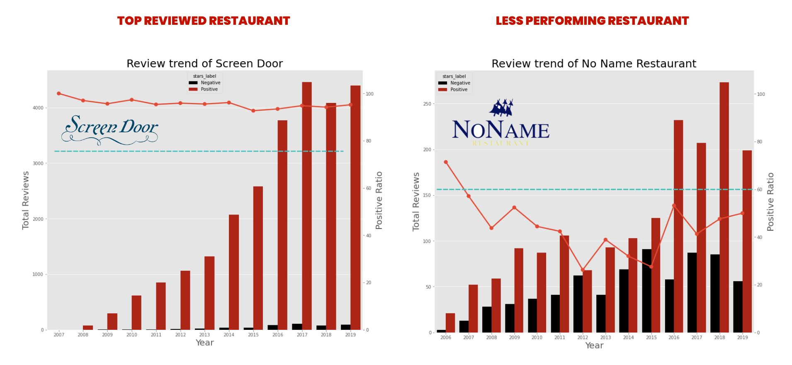
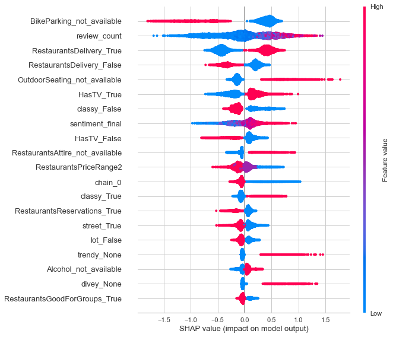
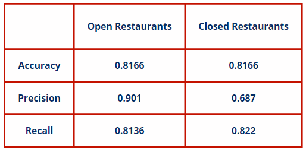

# Yelp Restaurants Business Reviews

## Problem Statement

Singapore's F&B market is worth S$8.3bn with expected 2.1% CAGR growth by 2023. Opportunities aside, F&B sector also operating in a competitive environment with the increase in numbers of restaurants. 
([*source*](https://www.dbs.com.sg/vickers/zh/research/featured/191022_featured_fnb-zh.page))

The goal of the project is to utilize user reviews data to help business owners understand why a business received good/bad ratings.
One could learn, exploit and improve the weaknesses of a restaurant and thus get a business advantage.
Develop a classification model based on restaurantsattributes to predict if a business will be closed. This enables investors to access the risk before investing in a restaurant. 

---

## Executive Summary

The data set consists of user reviews of restaurants from the Yelp Business dataset over more than 10 years. The location of restaurants focused on Massachusetts and Oregon, United States, including 16,256 restaurants and 2,282,296 reviews from 2004 up to 2021. Business info includes restaurants' location, attributes, category, overall rating, and labels that show whether a restaurant is opened or permanently closed. Reviews include user rating, user information, and a plain text review. 

The distribution of review ratings was skewed to the left with more users giving higher ratings than lower ratings on average. Restaurants that remained open has a higher distributions of ratings more than 4.5 stars and above meanwhile permenantly closed restaurants has higher counts of ratings below 3.5 star and below. 

Natural language processing technique is used to further analyse the customer reviews text to understand the reasons of user giving good or bad reviews. 
Three NLP technique use includes:-
<ol>
<li>Using TF-IDF Vectorizer to study the Bi-gram and Tri-gram of good and bad reviews</li>
<li>Using Word2Vec's Continuous bag-of-words model (CBOW) to Predict output words of good and bad reviews</li>
<li>Using DistilBERT model to obtain sentiment score of customers reviews to be added as feature for modelling.</li>
</ol>

The machine learning model used was supervised machine learning including `RandomForestClassifier`,`Gradient Boosting Classifier`,`LogisticRegression`,and `Extra Trees Classifier`. The dataset was split into a 70% training set and 30% testing set using stratified sampling. 
The performance of different machine learning models on the data set is measured using accuracy, precision, F1 score confusion matrix, and roc curve evaluation metrics.

---

## EDA

We observed that successful restaurants businesses generally maintained a positive reviews ratio above 80%. Meanwhile, less-performing restaurants have low positive reviews with a positive ratio held at 60% below. Those restaurants have a higher rate of going out of business. To improve the positive ratio of restaurants, the business owner shall strive to reduce the number of negative reviews based on the comments/suggestions provided by customers. 

## User reviews analysis 

In general, we found out that customers leave negative reviews due to unsatisfied customer service. It could be due to long waiting times and untrained staff to handle the customer's experiences. Those users who left negative reviews also commented that they would not revisit the restaurants, which would leave a negative impression on the other users. On the other hand, most customers left 5-star reviews due to satisfied customer service and food. A small gesture like getting customers seated right away and friendly staff will make the customers feel loved. Wider variations of food menu and promotions such as happy hour tend to get customers positive reviews. 

## Modelling
To predict the closure of the restaurants, Light Gradient Boosting model (LGBM) has the highest accuracy of 81.72% and  F1 scores of 80.87% follows by Random Forest Classifier with 81.40% accuracy and 85.27% F1 socres.

The importance features that affect the model decision are Sentiment score, Review counts, Ratings, and restaurant price range which have a more significant effect on the model to predict whether a restaurant is close or open.

SHAP value below shows the predictors' positive and negative relationships with the target variable. 

Based on the confusion matrix, LGBM able to predict opened restaurants with 90% precision. Only 10% remain as false positive. This shows that if a bank that provides a loan based on this decision gives 10% fault rate, compared to 39% (Closed rate in the dataset) However, the LGBM performing less ideal in case of predictiong closed restaurants. Out of the model prediction closed, Only 68% of the restaurants had truly closed down. It might mistakenly predict the restaurant remains open as closed.

## Conclusion and Recommendation

Based on the Yelp business reviews analysis, the key elements to build a successful restaurants are: 
<ol>
<li>Maintain high positive review ration</li>
<li>Well trained staffs</li>
<li>Provide quality customer service</li>
<li>Good marketing strategy</li>
<li>Franchise</li>
</ol>

In order to improve customers' dining experience in a restaurant, the improvement should start from the restaurant itself. We would recommend the business owner create the right culture within the restaurant. Cultivate a positive work environment where team members love what they do and where they work. Invest in the employee, such as providing benefits to the employee, including comprehensive training programs, substantial benefits, and growth opportunities.